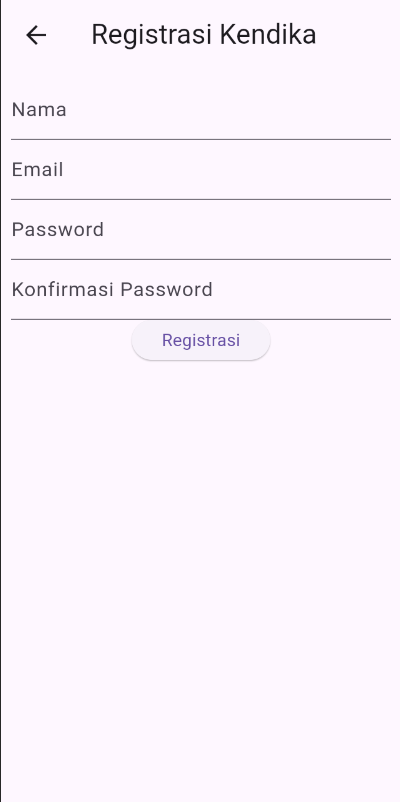
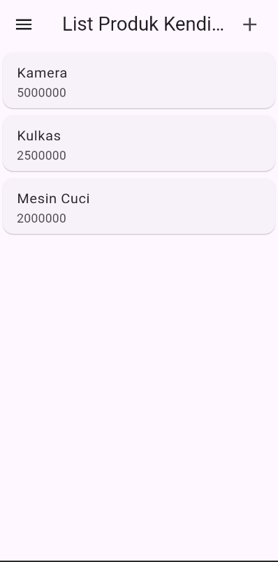
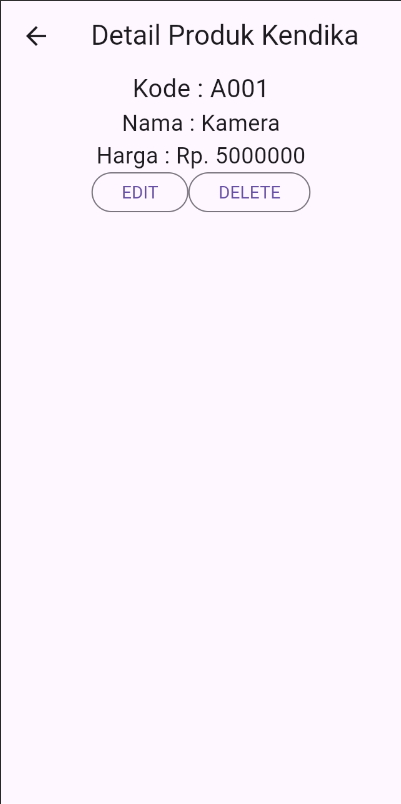
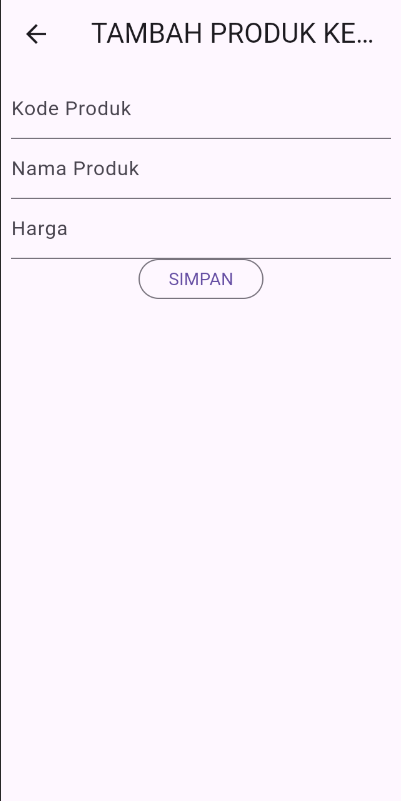
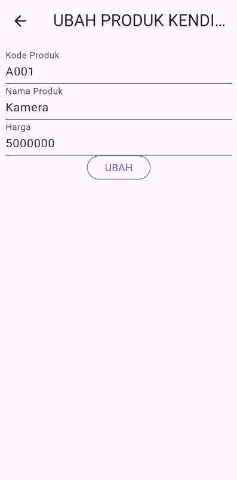

# Toko Kita - Dokumentasi Penjelasan Kode

Aplikasi Flutter untuk manajemen toko produk dengan fitur login, registrasi, dan CRUD produk.

---

## 📸 Screenshots

| Login Page | Registrasi Page | Produk List |
|---|---|---|
|  |  |  |

| Produk Detail | Tambah Produk | Ubah Produk |
|---|---|---|
|  |  |  |

> 💡 **Catatan:** Letakkan file screenshot di folder `screenshots/` dengan format PNG dan nama sesuai di atas.

---

## 📁 Struktur Project

```
lib/
├── main.dart
├── model/
│   ├── login.dart
│   ├── registrasi.dart
│   └── produk.dart
└── ui/
    ├── login_page.dart
    ├── registrasi_page.dart
    ├── produk_page.dart
    ├── produk_form.dart
    └── produk_detail.dart
```

---

## 📱 Penjelasan Setiap Halaman

### 1. **Main.dart** - Entry Point Aplikasi

**Fungsi:**
- Entry point aplikasi yang mengatur konfigurasi MaterialApp
- Mengatur halaman awal dan routing aplikasi

**Kode Penjelasan:**

```dart
void main() {
  runApp(const MyApp());
}
```
- `main()` adalah fungsi utama yang menjalankan aplikasi
- `runApp()` menjalankan widget MyApp sebagai root aplikasi

```dart
return MaterialApp(
  title: 'Toko Kita',
  debugShowCheckedModeBanner: false,
  home: const LoginPage(),
  routes: {
    '/produk': (context) => const ProdukPage(),
  },
);
```
- `title`: Nama aplikasi
- `debugShowCheckedModeBanner`: Menghilangkan banner debug di pojok kanan atas
- `home`: Halaman pertama saat aplikasi dibuka (LoginPage)
- `routes`: Mendefinisikan rute navigasi bernama untuk routing aplikasi
  - `/produk` akan mengarahkan ke `ProdukPage`

---

### 2. **Login Page** - Halaman Login

**File:** `lib/ui/login_page.dart`

**Fungsi:**
- User melakukan login dengan email dan password
- Validasi input form
- Navigasi ke halaman produk jika login berhasil
- Link ke halaman registrasi

**Komponen Utama:**

#### **_emailTextField()**
```dart
Widget _emailTextField() {
  return TextFormField(
    decoration: const InputDecoration(labelText: "Email"),
    keyboardType: TextInputType.emailAddress,
    controller: _emailTextboxController,
    validator: (value) {
      if (value!.isEmpty) {
        return 'Email harus diisi';
      }
      return null;
    },
  );
}
```
- `TextFormField`: Widget untuk input teks dengan validasi otomatis
- `controller`: Menghubungkan TextFormField dengan _emailTextboxController untuk mengakses nilainya
- `keyboardType`: Menampilkan keyboard email
- `validator`: Fungsi yang berjalan saat form di-validate, mengembalikan string error jika ada

#### **_passwordTextField()**
```dart
Widget _passwordTextField() {
  return TextFormField(
    decoration: const InputDecoration(labelText: "Password"),
    keyboardType: TextInputType.text,
    obscureText: true,  // Menyembunyikan karakter password
    controller: _passwordTextboxController,
    validator: (value) {
      if (value!.isEmpty) {
        return "Password harus diisi";
      }
      return null;
    },
  );
}
```
- `obscureText: true`: Password ditampilkan sebagai titik-titik
- Validasi memastikan password tidak boleh kosong

#### **_buttonLogin()**
```dart
Widget _buttonLogin() {
  return ElevatedButton(
    child: const Text("Login"),
    onPressed: () {
      if (_formKey.currentState!.validate()) {
        Navigator.of(context).pushReplacementNamed('/produk');
      }
    },
  );
}
```
- `_formKey.currentState!.validate()`: Memanggil validasi semua TextFormField
- `pushReplacementNamed()`: Navigasi ke halaman produk dan menghapus halaman login dari stack (user tidak bisa kembali dengan tombol back)

#### **_menuRegistrasi()**
```dart
Widget _menuRegistrasi() {
  return Center(
    child: InkWell(
      child: const Text(
        "Registrasi",
        style: TextStyle(color: Colors.blue),
      ),
      onTap: () {
        Navigator.push(
          context,
          MaterialPageRoute(builder: (context) => const RegistrasiPage()),
        );
      },
    ),
  );
}
```
- `InkWell`: Widget yang mendeteksi tap/click dengan efek visual
- `Navigator.push()`: Menambah halaman baru ke stack (user bisa kembali dengan tombol back)

---

### 3. **Registrasi Page** - Halaman Pendaftaran

**File:** `lib/ui/registrasi_page.dart`

**Fungsi:**
- User mendaftar dengan nama, email, password, dan konfirmasi password
- Validasi input dengan ketentuan tertentu
- Menampilkan pesan sukses jika registrasi berhasil
- Kembali ke halaman login

**Komponen Utama:**

#### **_namaTextField()**
```dart
Widget _namaTextField() {
  return TextFormField(
    decoration: const InputDecoration(labelText: "Nama"),
    keyboardType: TextInputType.text,
    controller: _namaTextboxController,
    validator: (value) {
      if (value!.length < 3) {
        return "Nama harus diisi minimal 3 karakter";
      }
      return null;
    },
  );
}
```
- Validasi: Nama minimal 3 karakter
- `value!.length`: Mendapatkan panjang string

#### **_emailTextField()**
```dart
Widget _emailTextField() {
  return TextFormField(
    decoration: const InputDecoration(labelText: "Email"),
    keyboardType: TextInputType.emailAddress,
    controller: _emailTextboxController,
    validator: (value) {
      if (value!.isEmpty) {
        return 'Email harus diisi';
      }
      Pattern pattern = r'^(([^<>()[\]\\.,;:\s@\"]+(\.[^<>()[\]\\.,;:\s@\"]+)*)|(\".+\"))@((\[[0-9]{1,3}\.[0-9]{1,3}\.[0-9]{1,3}\.[0-9]{1,3}\])|(([a-zA-Z\-0-9]+\.)+[a-zA-Z]{2,}))$';
      RegExp regex = RegExp(pattern.toString());
      if (!regex.hasMatch(value)) {
        return "Email tidak valid";
      }
      return null;
    },
  );
}
```
- Validasi 1: Email tidak boleh kosong
- Validasi 2: Email harus sesuai format menggunakan regex
- `RegExp.hasMatch()`: Mengecek apakah string cocok dengan pola regex

#### **_passwordTextField()**
```dart
Widget _passwordTextField() {
  return TextFormField(
    decoration: const InputDecoration(labelText: "Password"),
    keyboardType: TextInputType.text,
    obscureText: true,
    controller: _passwordTextboxController,
    validator: (value) {
      if (value!.length < 6) {
        return "Password harus diisi minimal 6 karakter";
      }
      return null;
    },
  );
}
```
- Validasi: Password minimal 6 karakter

#### **_passwordKonfirmasiTextField()**
```dart
Widget _passwordKonfirmasiTextField() {
  return TextFormField(
    decoration: const InputDecoration(labelText: "Konfirmasi Password"),
    keyboardType: TextInputType.text,
    obscureText: true,
    validator: (value) {
      if (value != _passwordTextboxController.text) {
        return "Konfirmasi Password tidak sama";
      }
      return null;
    },
  );
}
```
- Validasi: Konfirmasi password harus sama dengan password yang diinput sebelumnya
- Membandingkan dengan controller password asli: `_passwordTextboxController.text`

#### **_buttonRegistrasi()**
```dart
Widget _buttonRegistrasi() {
  return ElevatedButton(
    child: const Text("Registrasi"),
    onPressed: () {
      if (_formKey.currentState!.validate()) {
        ScaffoldMessenger.of(context).showSnackBar(
          const SnackBar(content: Text('Registrasi Berhasil! Silahkan Login')),
        );
        Navigator.of(context).pop();
      }
    },
  );
}
```
- Jika validasi sukses:
  - `showSnackBar()`: Menampilkan notifikasi di bawah layar
  - `Navigator.pop()`: Kembali ke halaman sebelumnya (Login)

---

### 4. **Produk Page** - Halaman List Produk

**File:** `lib/ui/produk_page.dart`

**Fungsi:**
- Menampilkan daftar produk dalam bentuk list
- Tombol tambah produk di appBar
- Menu drawer untuk logout
- Setiap item produk bisa diklik untuk melihat detail

**Struktur:**

```dart
@override
Widget build(BuildContext context) {
  return Scaffold(
    appBar: AppBar(
      title: const Text('List Produk Kendika'),
      actions: [
        Padding(
          padding: const EdgeInsets.only(right: 20.0),
          child: GestureDetector(
            child: const Icon(Icons.add, size: 26.0),
            onTap: () async {
              Navigator.push(
                context,
                MaterialPageRoute(builder: (context) => ProdukForm()),
              );
            },
          ),
        )
      ],
    ),
```
- `appBar.actions`: Widget yang ditampilkan di sebelah kanan appBar
- `GestureDetector`: Mendeteksi tap pada icon tambah
- `onTap()`: Navigasi ke halaman form produk untuk tambah data baru

```dart
drawer: Drawer(
  child: ListView(
    children: [
      ListTile(
        title: const Text('Logout'),
        trailing: const Icon(Icons.logout),
        onTap: () async {},
      )
    ],
  ),
),
```
- `Drawer`: Menu samping yang bisa dibuka dengan swipe atau tombol menu
- `ListTile`: Item dalam drawer

```dart
body: ListView(
  children: [
    ItemProduk(
      produk: Produk(
        id: '1',
        kodeProduk: 'A001',
        namaProduk: 'Kamera',
        hargaProduk: 5000000,
      ),
    ),
    // ... item produk lainnya
  ],
),
```
- `ListView`: Widget untuk menampilkan daftar item yang bisa scroll
- Setiap `ItemProduk` menampilkan satu produk

#### **ItemProduk Widget** - Custom Widget untuk Item Produk

```dart
class ItemProduk extends StatelessWidget {
  final Produk produk;

  const ItemProduk({Key? key, required this.produk}) : super(key: key);

  @override
  Widget build(BuildContext context) {
    return GestureDetector(
      onTap: () {
        Navigator.push(
          context,
          MaterialPageRoute(
            builder: (context) => ProdukDetail(
              produk: produk,
            ),
          ),
        );
      },
      child: Card(
        child: ListTile(
          title: Text(produk.namaProduk!),
          subtitle: Text(produk.hargaProduk.toString()),
        ),
      ),
    );
  }
}
```
- `StatelessWidget`: Widget immutable (tidak berubah setelah dibuat)
- `required this.produk`: Parameter produk wajib diberikan
- `Card`: Widget yang menampilkan kartu dengan shadow dan elevation
- `ListTile`: Layout standar dengan title, subtitle, icon, dst
- `onTap()`: Navigasi ke halaman detail produk dengan membawa data produk

---

### 5. **Produk Form** - Halaman Form Tambah/Ubah Produk

**File:** `lib/ui/produk_form.dart`

**Fungsi:**
- Form untuk menambah produk baru
- Form untuk mengubah produk yang sudah ada
- Validasi input form
- Judul dan tombol berubah sesuai konteks (Tambah vs Ubah)

**Komponen Utama:**

#### **initState() dan isUpdate()**
```dart
@override
void initState() {
  super.initState();
  isUpdate();
}

isUpdate() {
  if (widget.produk != null) {
    setState(() {
      judul = "UBAH PRODUK KENDIKA";
      tombolSubmit = "UBAH";
      _kodeProdukTextboxController.text = widget.produk!.kodeProduk!;
      _namaProdukTextboxController.text = widget.produk!.namaProduk!;
      _hargaProdukTextboxController.text = widget.produk!.hargaProduk.toString();
    });
  } else {
    judul = "TAMBAH PRODUK KENDIKA";
    tombolSubmit = "SIMPAN";
  }
}
```
- `initState()`: Dijalankan sekali saat widget pertama kali dibuat
- `isUpdate()`: Mengecek apakah ada data produk yang dikirim
  - Jika ada (ubah mode): Isi form dengan data produk, ubah judul dan tombol
  - Jika tidak ada (tambah mode): Tampilkan form kosong dengan judul "Tambah"
- `setState()`: Memanggil rebuild widget dengan state baru

#### **_kodeProdukTextField(), _namaProdukTextField(), _hargaProdukTextField()**
```dart
Widget _kodeProdukTextField() {
  return TextFormField(
    decoration: const InputDecoration(labelText: "Kode Produk"),
    keyboardType: TextInputType.text,
    controller: _kodeProdukTextboxController,
    validator: (value) {
      if (value!.isEmpty) {
        return "Kode Produk harus diisi";
      }
      return null;
    },
  );
}
```
- Setiap field memiliki controller sendiri untuk menyimpan nilainya
- Validasi memastikan field tidak boleh kosong
- `keyboardType`: Disesuaikan dengan tipe input (text, number, email, dll)

#### **_buttonSubmit()**
```dart
Widget _buttonSubmit() {
  return OutlinedButton(
    child: Text(tombolSubmit),
    onPressed: () {
      _formKey.currentState!.validate();
    },
  );
}
```
- Tombol dinamis, teksnya berubah sesuai mode (SIMPAN atau UBAH)
- Memanggil validate untuk memvalidasi form

---

### 6. **Produk Detail** - Halaman Detail Produk

**File:** `lib/ui/produk_detail.dart`

**Fungsi:**
- Menampilkan detail produk lengkap
- Tombol EDIT untuk mengubah produk
- Tombol DELETE untuk menghapus produk dengan konfirmasi

**Struktur:**

```dart
@override
Widget build(BuildContext context) {
  return Scaffold(
    appBar: AppBar(
      title: const Text('Detail Produk Kendika'),
    ),
    body: Center(
      child: Column(
        children: [
          Text(
            "Kode : ${widget.produk!.kodeProduk}",
            style: const TextStyle(fontSize: 20.0),
          ),
          Text(
            "Nama : ${widget.produk!.namaProduk}",
            style: const TextStyle(fontSize: 18.0),
          ),
          Text(
            "Harga : Rp. ${widget.produk!.hargaProduk.toString()}",
            style: const TextStyle(fontSize: 18.0),
          ),
          _tombolHapusEdit()
        ],
      ),
    ),
  );
}
```
- `${widget.produk!.property}`: String interpolation untuk menampilkan data dari produk
- `!`: Null assertion operator (developer yakin nilai tidak null)

#### **_tombolHapusEdit()**
```dart
Widget _tombolHapusEdit() {
  return Row(
    mainAxisSize: MainAxisSize.min,
    children: [
      OutlinedButton(
        child: const Text("EDIT"),
        onPressed: () {
          Navigator.push(
            context,
            MaterialPageRoute(
              builder: (context) => ProdukForm(
                produk: widget.produk!,
              ),
            ),
          );
        },
      ),
      OutlinedButton(
        child: const Text("DELETE"),
        onPressed: () => confirmHapus(),
      ),
    ],
  );
}
```
- `Row`: Layout horizontal
- Tombol EDIT: Navigasi ke form produk dengan membawa data produk (mode ubah)
- Tombol DELETE: Memanggil fungsi konfirmasi hapus

#### **confirmHapus()**
```dart
void confirmHapus() {
  AlertDialog alertDialog = AlertDialog(
    content: const Text("Yakin ingin menghapus data ini?"),
    actions: [
      OutlinedButton(
        child: const Text("Ya"),
        onPressed: () {
          Navigator.of(context).push(
            MaterialPageRoute(
              builder: (context) => const ProdukPage(),
            ),
          );
        },
      ),
      OutlinedButton(
        child: const Text("Batal"),
        onPressed: () => Navigator.pop(context),
      )
    ],
  );
  showDialog(builder: (context) => alertDialog, context: context);
}
```
- `AlertDialog`: Dialog konfirmasi
- Tombol Ya: Navigasi kembali ke halaman list produk
- Tombol Batal: Menutup dialog (kembali ke halaman detail)

---

## 🔄 Alur Navigasi Aplikasi

```
LoginPage
  ↓ (klik Registrasi)
RegistrasiPage
  ↓ (klik Registrasi, validasi sukses)
LoginPage
  ↓ (klik Login, validasi sukses)
ProdukPage
  ├─ (klik icon +) → ProdukForm (mode Tambah)
  │  └─ (klik SIMPAN) → ProdukPage
  │
  ├─ (klik item produk) → ProdukDetail
  │  ├─ (klik EDIT) → ProdukForm (mode Ubah)
  │  │  └─ (klik UBAH) → ProdukPage
  │  │
  │  └─ (klik DELETE) → confirmHapus Dialog
  │     └─ (klik Ya) → ProdukPage
  │
  └─ (buka drawer, klik Logout) → [pending action]
```

---

## 📦 Model Data

### **Login Model** (`lib/model/login.dart`)
```dart
class Login {
  int? code;
  bool? status;
  String? token;
  int? userID;
  String? userEmail;
}
```
- Menyimpan response dari login API

### **Registrasi Model** (`lib/model/registrasi.dart`)
```dart
class Registrasi {
  int? code;
  bool? status;
  String? data;
}
```
- Menyimpan response dari registrasi API

### **Produk Model** (`lib/model/produk.dart`)
```dart
class Produk {
  String? id;
  String? kodeProduk;
  String? namaProduk;
  var hargaProduk;
}
```
- Menyimpan data produk

---

## 🛠️ Widget dan Konsep Utama yang Digunakan

| Widget/Konsep | Penjelasan |
|---|---|
| `Scaffold` | Struktur dasar halaman dengan appBar, body, drawer, dll |
| `StatefulWidget` | Widget yang bisa berubah state/data |
| `StatelessWidget` | Widget immutable yang tidak berubah |
| `TextFormField` | Input teks dengan validasi otomatis |
| `Form` | Container untuk mengelompokkan TextFormField |
| `Navigator` | Mengelola navigasi antar halaman |
| `GlobalKey<FormState>` | Key untuk mengakses state form |
| `TextEditingController` | Mengontrol dan mengakses nilai TextFormField |
| `ListView` | Menampilkan list item yang bisa scroll |
| `GestureDetector` | Mendeteksi tap/gesture pada widget |
| `Card` | Widget untuk menampilkan kartu dengan shadow |
| `AlertDialog` | Dialog untuk konfirmasi atau peringatan |
| `SnackBar` | Notifikasi yang muncul di bawah layar |

---

## ✅ Fitur Aplikasi

- ✅ Login dengan validasi email dan password
- ✅ Registrasi dengan validasi nama, email, password
- ✅ Tampil daftar produk dalam list
- ✅ Tambah produk baru
- ✅ Edit/ubah produk
- ✅ Hapus produk dengan konfirmasi
- ✅ Navigasi halaman
- ✅ Drawer menu logout

---

## 📝 Catatan Pengembangan

- Fitur logout belum diimplementasikan sepenuhnya (onTap kosong)
- Delete produk belum terhubung dengan backend/database
- Belum ada integrasi API untuk login dan registrasi
- Data produk masih hardcoded (dummy data)

---

**Dibuat oleh:** Kendika  
**Tanggal:** 25 November 2025  
**Framework:** Flutter  
**Bahasa:** Dart
