# Toko Kita - Dokumentasi Lengkap Aplikasi Flutter

Aplikasi Flutter untuk manajemen toko produk dengan fitur login, registrasi, dan CRUD produk menggunakan API Backend.

---

## 📋 Daftar Isi

1. [Proses Login](#1-proses-login)
2. [Proses Registrasi](#2-proses-registrasi)
3. [Proses Melihat Daftar Produk](#3-proses-melihat-daftar-produk)
4. [Proses Tambah Data Produk](#4-proses-tambah-data-produk)
5. [Proses Ubah Data Produk](#5-proses-ubah-data-produk)
6. [Proses Hapus Data Produk](#6-proses-hapus-data-produk)
7. [Proses Logout](#7-proses-logout)

---

## 1. **Proses Login**

### a. Input Form Login
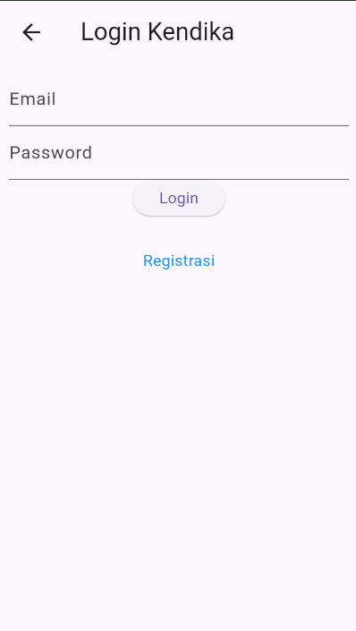

**Penjelasan:**
- User memasukkan email dan password pada form login
- Terdapat validasi untuk memastikan kedua field tidak kosong
- Terdapat link "Registrasi" untuk user yang belum memiliki akun

**Kode Form Login:**
```dart
Widget _emailTextField() {
  return TextFormField(
    decoration: const InputDecoration(labelText: "Email"),
    keyboardType: TextInputType.emailAddress,
    controller: _emailTextboxController,
    validator: (value) {
      if (value!.isEmpty) {
        return 'Email harus diisi';
      }
      return null;
    },
  );
}

Widget _passwordTextField() {
  return TextFormField(
    decoration: const InputDecoration(labelText: "Password"),
    keyboardType: TextInputType.text,
    obscureText: true,
    controller: _passwordTextboxController,
    validator: (value) {
      if (value!.isEmpty) {
        return "Password harus diisi";
      }
      return null;
    },
  );
}

Widget _buttonLogin() {
  return ElevatedButton(
    child: const Text("Login"),
    onPressed: () {
      var validate = _formKey.currentState!.validate();
      if (validate) {
        if (!_isLoading) _submit();
      }
    }
  );
}
```

### b. Proses Submit Login
**Kode Submit Login:**

```dart
void _submit() {
  _formKey.currentState!.save();
  setState(() {
    _isLoading = true;
  });
  
  LoginBloc.login(
    email: _emailTextboxController.text,
    password: _passwordTextboxController.text
  ).then((value) async {
    await UserInfo().setToken(value.token.toString());
    await UserInfo().setUserID(int.parse(value.userID.toString()));
    Navigator.pushReplacement(
      context,
      MaterialPageRoute(builder: (context) => const ProdukPage())
    );
  }).catchError((error) {
    showDialog(
      context: context,
      barrierDismissible: false,
      builder: (BuildContext context) => WarningDialog(
        description: "Login gagal, silahkan coba lagi",
        okCallback: () {
          Navigator.pop(context);
        },
      )
    );
  }).whenComplete(() => setState(() {
    _isLoading = false;
  }));
}
```

### c. Login Berhasil


**Penjelasan:**
- Setelah login berhasil, user langsung diarahkan ke halaman daftar produk
- Token dan User ID disimpan menggunakan SharedPreferences
- Navigation menggunakan `pushReplacement` sehingga user tidak bisa kembali ke halaman login dengan tombol back

### d. Login Gagal
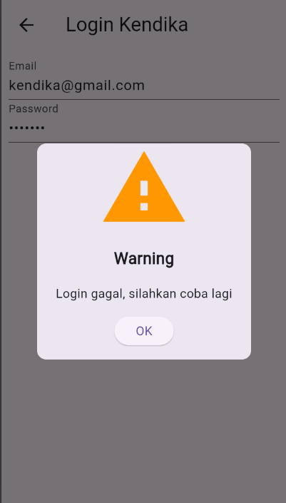

**Penjelasan:**
- Jika login gagal, muncul dialog peringatan dengan pesan error
- User dapat menutup dialog dan mencoba login kembali
- Form tidak di-reset sehingga user tidak perlu mengetik ulang

---

## 2. **Proses Registrasi**

### a. Input Form Registrasi
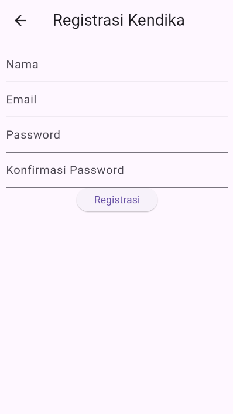

**Penjelasan:**
- User mengisi form dengan nama, email, password, dan konfirmasi password
- Terdapat validasi untuk setiap field dengan aturan tertentu
- Nama minimal 3 karakter, email harus format valid, password minimal 6 karakter

**Kode Validasi Form:**
```dart
Widget _namaTextField() {
  return TextFormField(
    decoration: const InputDecoration(labelText: "Nama"),
    keyboardType: TextInputType.text,
    controller: _namaTextboxController,
    validator: (value) {
      if (value!.length < 3) {
        return "Nama harus diisi minimal 3 karakter";
      }
      return null;
    },
  );
}

Widget _emailTextField() {
  return TextFormField(
    decoration: const InputDecoration(labelText: "Email"),
    keyboardType: TextInputType.emailAddress,
    controller: _emailTextboxController,
    validator: (value) {
      if (value!.isEmpty) {
        return 'Email harus diisi';
      }
      Pattern pattern = r'^(([^<>()[\]\\.,;:\s@\"]+(\.[^<>()[\]\\.,;:\s@\"]+)*)|(\".+\"))@((\[[0-9]{1,3}\.[0-9]{1,3}\.[0-9]{1,3}\.[0-9]{1,3}\])|(([a-zA-Z\-0-9]+\.)+[a-zA-Z]{2,}))$';
      RegExp regex = RegExp(pattern.toString());
      if (!regex.hasMatch(value)) {
        return "Email tidak valid";
      }
      return null;
    },
  );
}

Widget _passwordKonfirmasiTextField() {
  return TextFormField(
    decoration: const InputDecoration(labelText: "Konfirmasi Password"),
    keyboardType: TextInputType.text,
    obscureText: true,
    validator: (value) {
      if (value != _passwordTextboxController.text) {
        return "Konfirmasi Password tidak sama";
      }
      return null;
    },
  );
}
```

### b. Proses Submit Registrasi
**Kode Submit Registrasi:**
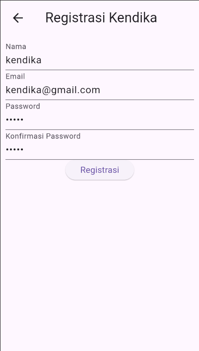
```dart
void _submit() {
  _formKey.currentState!.save();
  setState(() {
    _isLoading = true;
  });
  
  RegistrasiBloc.registrasi(
    nama: _namaTextboxController.text,
    email: _emailTextboxController.text,
    password: _passwordTextboxController.text
  ).then((value) {
    showDialog(
      context: context,
      barrierDismissible: false,
      builder: (BuildContext context) => SuccessDialog(
        description: "Registrasi berhasil, silahkan login",
        okCallback: () {
          Navigator.pushReplacement(
            context,
            MaterialPageRoute(builder: (context) => const LoginPage())
          );
        },
      )
    );
  }).catchError((error) {
    showDialog(
      context: context,
      barrierDismissible: false,
      builder: (BuildContext context) => WarningDialog(
        description: "Registrasi gagal, silahkan coba lagi",
        okCallback: () {
          Navigator.pop(context);
        },
      )
    );
  }).whenComplete(() => setState(() {
    _isLoading = false;
  }));
}
```

### c. Registrasi Berhasil
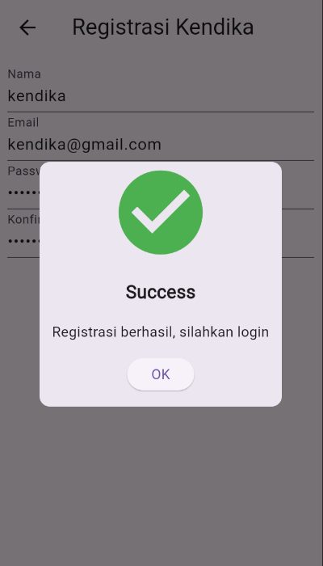

**Penjelasan:**
- Setelah registrasi berhasil, muncul dialog sukses dengan pesan konfirmasi
- User diarahkan kembali ke halaman login untuk melakukan login dengan akun yang baru dibuat
- Data registrasi dikirim ke API backend untuk disimpan

### d. Registrasi Gagal


**Penjelasan:**
- Jika registrasi gagal (email salah regex, password kurang dari 6), muncul dialog peringatan
- User dapat menutup dialog dan memperbaiki data yang diinput
- Form tetap berisi data yang sudah diinput sebelumnya

---

## 3. **Proses Melihat Daftar Produk**

### a. Halaman List Produk
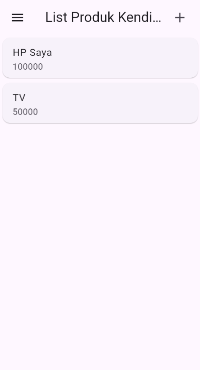

**Penjelasan:**
- Setelah login berhasil, user melihat daftar produk yang tersedia
- Setiap produk ditampilkan dalam bentuk Card dengan nama dan harga
- Terdapat tombol "+" di AppBar untuk menambah produk baru
- Terdapat menu drawer untuk logout

**Kode Fetch Data Produk:**
```dart
class _ProdukPageState extends State<ProdukPage> {
  List<Produk> listProduk = [];

  @override
  void initState() {
    super.initState();
    _loadProduks();
  }

  void _loadProduks() {
    ProdukBloc.getProduks().then((produks) {
      setState(() {
        listProduk = produks;
      });
    }).catchError((error) {
      showDialog(
        context: context,
        builder: (context) => WarningDialog(
          description: "Gagal memuat data produk",
          okCallback: () => Navigator.pop(context),
        ),
      );
    });
  }

  @override
  Widget build(BuildContext context) {
    return Scaffold(
      appBar: AppBar(
        title: const Text('List Produk'),
        actions: [
          Padding(
            padding: const EdgeInsets.only(right: 20.0),
            child: GestureDetector(
              child: const Icon(Icons.add, size: 26.0),
              onTap: () async {
                Navigator.push(
                  context,
                  MaterialPageRoute(builder: (context) => ProdukForm()),
                );
              },
            ),
          )
        ],
      ),
      drawer: Drawer(
        child: ListView(
          children: [
            ListTile(
              title: const Text('Logout'),
              trailing: const Icon(Icons.logout),
              onTap: () async {
                LogoutBloc.logout(context);
              },
            )
          ],
        ),
      ),
      body: ListView.builder(
        itemCount: listProduk.length,
        itemBuilder: (context, index) {
          return ItemProduk(produk: listProduk[index]);
        },
      ),
    );
  }
}
```

### b. Widget Item Produk
**Kode Item Produk:**
```dart
class ItemProduk extends StatelessWidget {
  final Produk produk;

  const ItemProduk({Key? key, required this.produk}) : super(key: key);

  @override
  Widget build(BuildContext context) {
    return GestureDetector(
      onTap: () {
        Navigator.push(
          context,
          MaterialPageRoute(
            builder: (context) => ProdukDetail(produk: produk),
          ),
        );
      },
      child: Card(
        child: ListTile(
          title: Text(produk.namaProduk!),
          subtitle: Text("Rp. ${produk.hargaProduk.toString()}"),
          leading: Text(produk.kodeProduk!),
        ),
      ),
    );
  }
}
```

---

## 4. **Proses Tambah Data Produk**

### a. Form Tambah Produk


**Penjelasan:**
- User mengklik tombol "+" pada halaman daftar produk
- Muncul form dengan field Kode Produk, Nama Produk, dan Harga
- Semua field wajib diisi dengan validasi masing-masing
- Tombol berubah menjadi "SIMPAN" untuk mode tambah

**Kode Form Produk:**
```dart
class _ProdukFormState extends State<ProdukForm> {
  final _formKey = GlobalKey<FormState>();
  bool _isLoading = false;
  String judul = "TAMBAH PRODUK";
  String tombolSubmit = "SIMPAN";

  final _kodeProdukTextboxController = TextEditingController();
  final _namaProdukTextboxController = TextEditingController();
  final _hargaProdukTextboxController = TextEditingController();

  @override
  void initState() {
    super.initState();
    isUpdate();
  }

  isUpdate() {
    if (widget.produk != null) {
      setState(() {
        judul = "UBAH PRODUK";
        tombolSubmit = "UBAH";
        _kodeProdukTextboxController.text = widget.produk!.kodeProduk!;
        _namaProdukTextboxController.text = widget.produk!.namaProduk!;
        _hargaProdukTextboxController.text = widget.produk!.hargaProduk.toString();
      });
    } else {
      judul = "TAMBAH PRODUK";
      tombolSubmit = "SIMPAN";
    }
  }

  Widget _buttonSubmit() {
    return ElevatedButton(
      child: Text(tombolSubmit),
      onPressed: () {
        var validate = _formKey.currentState!.validate();
        if (validate) {
          if (!_isLoading) {
            if (widget.produk != null) {
              ubah();
            } else {
              simpan();
            }
          }
        }
      },
    );
  }
}
```

### b. Proses Simpan Produk Baru
**Kode Simpan Produk:**
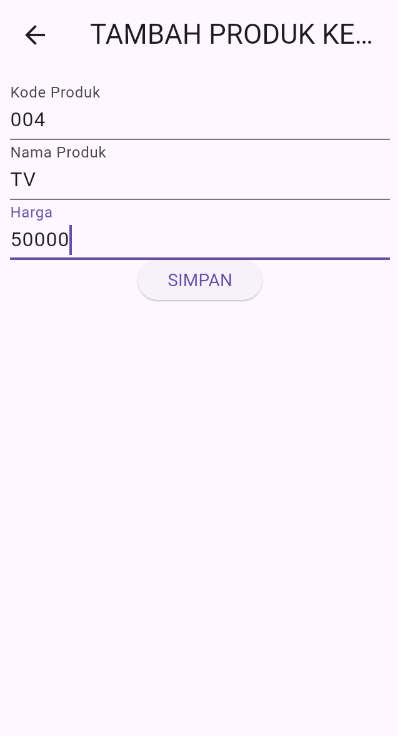
```dart
void simpan() {
  setState(() {
    _isLoading = true;
  });

  Produk createProduk = Produk();
  createProduk.kodeProduk = _kodeProdukTextboxController.text;
  createProduk.namaProduk = _namaProdukTextboxController.text;
  createProduk.hargaProduk = int.parse(_hargaProdukTextboxController.text);

  ProdukBloc.addProduk(produk: createProduk).then((value) {
    showDialog(
      context: context,
      barrierDismissible: false,
      builder: (BuildContext context) => SuccessDialog(
        description: "Produk berhasil ditambahkan",
        okCallback: () {
          Navigator.of(context).pushReplacement(
            MaterialPageRoute(builder: (context) => const ProdukPage())
          );
        },
      ),
    );
  }).catchError((error) {
    showDialog(
      context: context,
      builder: (BuildContext context) => WarningDialog(
        description: "Simpan gagal, silahkan coba lagi",
        okCallback: () {
          Navigator.pop(context);
        },
      ),
    );
  }).whenComplete(() => setState(() {
    _isLoading = false;
  }));
}
```

### c. Tambah Produk Berhasil


**Penjelasan:**
- Setelah berhasil menyimpan produk, muncul dialog sukses
- User diarahkan kembali ke halaman daftar produk
- Produk baru akan muncul dalam daftar
- Data dikirim ke API backend melalui ProdukBloc

## 5. **Proses Ubah Data Produk**

### a. Halaman Detail Produk
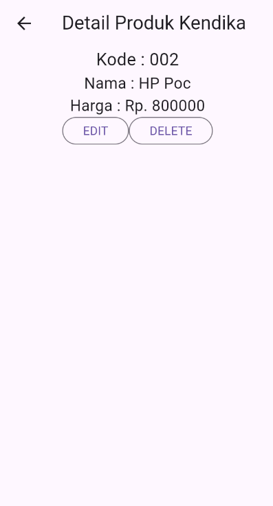

**Penjelasan:**
- User mengklik salah satu produk dari daftar untuk melihat detail
- Ditampilkan informasi lengkap produk: kode, nama, dan harga
- Terdapat tombol "EDIT" dan "DELETE" untuk manipulasi data
- User mengklik tombol "EDIT" untuk mengubah data produk

### b. Form Ubah Produk (Pre-filled)
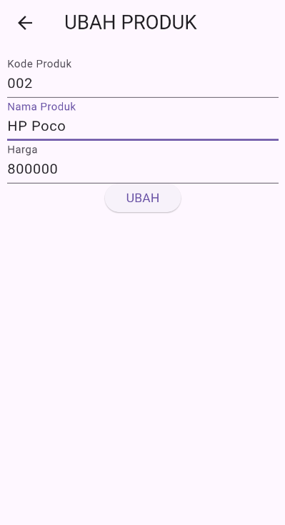

**Penjelasan:**
- Form yang sama dengan tambah produk, tetapi sudah terisi data existing
- Judul berubah menjadi "UBAH PRODUK" dan tombol menjadi "UBAH"
- User dapat mengubah field yang diinginkan
- Validasi tetap berlaku seperti pada form tambah

### c. Proses Update Produk
**Kode Update Produk:**
```dart
void ubah() {
  setState(() {
    _isLoading = true;
  });

  Produk updateProduk = Produk(id: widget.produk!.id);
  updateProduk.kodeProduk = _kodeProdukTextboxController.text;
  updateProduk.namaProduk = _namaProdukTextboxController.text;
  updateProduk.hargaProduk = int.parse(_hargaProdukTextboxController.text);

  ProdukBloc.updateProduk(produk: updateProduk).then((value) {
    showDialog(
      context: context,
      barrierDismissible: false,
      builder: (BuildContext context) => SuccessDialog(
        description: "Produk berhasil diubah",
        okCallback: () {
          Navigator.of(context).pushReplacement(
            MaterialPageRoute(builder: (context) => const ProdukPage())
          );
        },
      ),
    );
  }).catchError((error) {
    showDialog(
      context: context,
      builder: (BuildContext context) => WarningDialog(
        description: "Ubah gagal, silahkan coba lagi",
        okCallback: () {
          Navigator.pop(context);
        },
      ),
    );
  }).whenComplete(() => setState(() {
    _isLoading = false;
  }));
}
```

## 6. **Proses Hapus Data Produk**

### a. Konfirmasi Hapus Produk
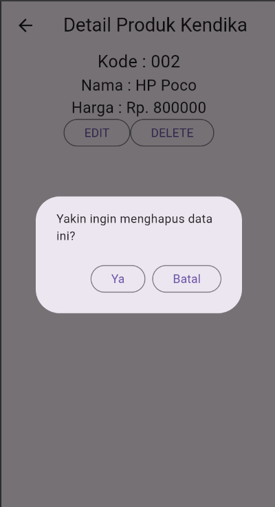

**Penjelasan:**
- User mengklik tombol "DELETE" pada halaman detail produk
- Muncul dialog konfirmasi dengan pertanyaan "Yakin ingin menghapus data ini?"
- User dapat memilih "Ya" untuk melanjutkan atau "Batal" untuk membatalkan
- Ini adalah safety mechanism untuk mencegah penghapusan yang tidak disengaja

**Kode Konfirmasi Hapus:**
```dart
void confirmHapus() {
  showDialog(
    context: context,
    builder: (BuildContext context) {
      return AlertDialog(
        content: const Text("Yakin ingin menghapus data ini?"),
        actions: [
          OutlinedButton(
            child: const Text("Ya"),
            onPressed: () {
              Navigator.pop(context); // Close confirmation dialog
              _deleteProduk();
            },
          ),
          OutlinedButton(
            child: const Text("Batal"),
            onPressed: () => Navigator.pop(context),
          )
        ],
      );
    },
  );
}
```

### b. Proses Delete Produk
**Kode Delete Produk:**
```dart
void _deleteProduk() {
  ProdukBloc.deleteProduk(id: int.parse(widget.produk!.id!)).then((value) {
    showDialog(
      context: context,
      barrierDismissible: false,
      builder: (BuildContext context) => SuccessDialog(
        description: "Produk berhasil dihapus",
        okCallback: () {
          Navigator.of(context).pushAndRemoveUntil(
            MaterialPageRoute(builder: (context) => const ProdukPage()),
            (Route<dynamic> route) => false,
          );
        },
      ),
    );
  }).catchError((error) {
    showDialog(
      context: context,
      builder: (BuildContext context) => WarningDialog(
        description: "Hapus gagal, silahkan coba lagi",
        okCallback: () {
          Navigator.pop(context);
        },
      ),
    );
  });
}
```

### c. Hapus Produk Berhasil
**Penjelasan:**
- Setelah konfirmasi, produk dihapus dari database melalui API
- Muncul dialog sukses konfirmasi penghapusan
- User diarahkan kembali ke halaman daftar produk
- Produk yang dihapus tidak lagi muncul dalam daftar

---

## 7. **Proses Logout**

### a. Menu Logout
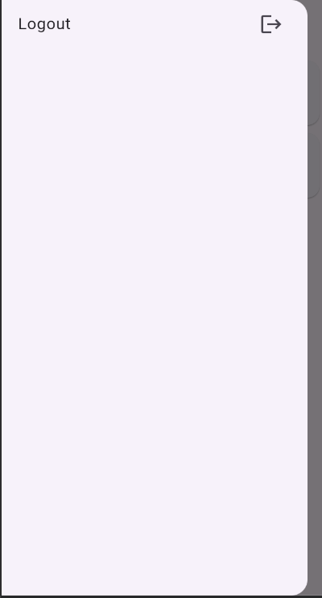
**Penjelasan:**
- User membuka drawer menu dari halaman daftar produk
- Terdapat menu "Logout" dengan icon logout
- User mengklik menu logout untuk keluar dari aplikasi

**Kode Logout:**
```dart
drawer: Drawer(
  child: ListView(
    children: [
      ListTile(
        title: const Text('Logout'),
        trailing: const Icon(Icons.logout),
        onTap: () async {
          LogoutBloc.logout(context);
        },
      )
    ],
  ),
),
```

### b. Proses Logout
**Kode LogoutBloc:**
```dart
class LogoutBloc {
  static Future logout(BuildContext context) async {
    await UserInfo().logout();
    Navigator.pushAndRemoveUntil(
      context,
      MaterialPageRoute(builder: (context) => const LoginPage()),
      (Route<dynamic> route) => false
    );
  }
}
```

**Penjelasan:**
- Token dan data user dihapus dari SharedPreferences
- User diarahkan kembali ke halaman login
- Stack navigation di-clear semua sehingga user tidak bisa kembali dengan tombol back
- User harus login kembali untuk mengakses aplikasi

---

## 📁 Struktur Project Lengkap

```
lib/
├── main.dart
├── bloc/
│   ├── login_bloc.dart
│   ├── logout_bloc.dart
│   ├── produk_bloc.dart
│   └── registrasi_bloc.dart
├── helpers/
│   ├── api.dart
│   ├── api_url.dart
│   ├── app_exception.dart
│   └── user_info.dart
├── model/
│   ├── login.dart
│   ├── registrasi.dart
│   └── produk.dart
├── ui/
│   ├── login_page.dart
│   ├── registrasi_page.dart
│   ├── produk_page.dart
│   ├── produk_form.dart
│   └── produk_detail.dart
└── widget/
    └── dialog.dart
    └── success_dialog.dart
    └── warning_dialog.dart
```

### Penjelasan Struktur:
- **bloc/**: Berisi business logic untuk setiap fitur (login, registrasi, produk, logout)
- **helpers/**: Berisi helper classes untuk API communication, URL management, dan user session
- **model/**: Berisi data models untuk Login, Registrasi, dan Produk
- **ui/**: Berisi semua halaman UI aplikasi
- **widget/**: Berisi custom widgets yang dapat digunakan ulang (SuccessDialog, WarningDialog)

---

## 🔧 Komponen Utama Aplikasi

### **BLoC Pattern Architecture**
Aplikasi menggunakan BLoC (Business Logic Component) pattern untuk memisahkan UI dari business logic:

```dart
// Contoh LoginBloc
class LoginBloc {
  static Future<Login> login({String? email, String? password}) async {
    String apiUrl = ApiUrl.login;
    var body = {"email": email, "password": password};
    var response = await Api().post(apiUrl, body);
    var jsonObj = json.decode(response.body);
    return Login.fromJson(jsonObj);
  }
}
```

### **API Communication**
Semua komunikasi dengan backend menggunakan helper class `Api`:

```dart
class Api {
  Future<Response> post(String url, dynamic body) async {
    var token = await UserInfo().getToken();
    var headers = {
      'Content-Type': 'application/json',
      'Authorization': 'Bearer $token'
    };
    return await http.post(Uri.parse(url), headers: headers, body: json.encode(body));
  }
}
```

### **Custom Dialogs**
Aplikasi menggunakan custom dialog widgets untuk feedback ke user:

```dart
class SuccessDialog extends StatelessWidget {
  final String description;
  final VoidCallback okCallback;

  @override
  Widget build(BuildContext context) {
    return Dialog(
      child: Column(
        mainAxisSize: MainAxisSize.min,
        children: [
          Icon(Icons.check_circle, color: Colors.green, size: 100),
          Text("Success", style: TextStyle(fontSize: 18, fontWeight: FontWeight.bold)),
          Text(description, textAlign: TextAlign.center),
          ElevatedButton(onPressed: okCallback, child: Text("OK")),
        ],
      ),
    );
  }
}
```

---

## Penjelasan Detail Setiap Halaman

### 1. **Main.dart** - Entry Point Aplikasi

**Fungsi:**
- Entry point aplikasi yang mengatur konfigurasi MaterialApp
- Mengatur halaman awal dan routing aplikasi

**Kode Penjelasan:**

```dart
void main() {
  runApp(const MyApp());
}
```
- `main()` adalah fungsi utama yang menjalankan aplikasi
- `runApp()` menjalankan widget MyApp sebagai root aplikasi

```dart
return MaterialApp(
  title: 'Toko Kita',
  debugShowCheckedModeBanner: false,
  home: const LoginPage(),
  routes: {
    '/produk': (context) => const ProdukPage(),
  },
);
```
- `title`: Nama aplikasi
- `debugShowCheckedModeBanner`: Menghilangkan banner debug di pojok kanan atas
- `home`: Halaman pertama saat aplikasi dibuka (LoginPage)
- `routes`: Mendefinisikan rute navigasi bernama untuk routing aplikasi
  - `/produk` akan mengarahkan ke `ProdukPage`

---

### 2. **Login Page** - Halaman Login

**File:** `lib/ui/login_page.dart`

**Fungsi:**
- User melakukan login dengan email dan password
- Validasi input form
- Navigasi ke halaman produk jika login berhasil
- Link ke halaman registrasi

**Komponen Utama:**

#### **_emailTextField()**
```dart
Widget _emailTextField() {
  return TextFormField(
    decoration: const InputDecoration(labelText: "Email"),
    keyboardType: TextInputType.emailAddress,
    controller: _emailTextboxController,
    validator: (value) {
      if (value!.isEmpty) {
        return 'Email harus diisi';
      }
      return null;
    },
  );
}
```
- `TextFormField`: Widget untuk input teks dengan validasi otomatis
- `controller`: Menghubungkan TextFormField dengan _emailTextboxController untuk mengakses nilainya
- `keyboardType`: Menampilkan keyboard email
- `validator`: Fungsi yang berjalan saat form di-validate, mengembalikan string error jika ada

#### **_passwordTextField()**
```dart
Widget _passwordTextField() {
  return TextFormField(
    decoration: const InputDecoration(labelText: "Password"),
    keyboardType: TextInputType.text,
    obscureText: true,  // Menyembunyikan karakter password
    controller: _passwordTextboxController,
    validator: (value) {
      if (value!.isEmpty) {
        return "Password harus diisi";
      }
      return null;
    },
  );
}
```
- `obscureText: true`: Password ditampilkan sebagai titik-titik
- Validasi memastikan password tidak boleh kosong

#### **_buttonLogin()**
```dart
Widget _buttonLogin() {
  return ElevatedButton(
    child: const Text("Login"),
    onPressed: () {
      if (_formKey.currentState!.validate()) {
        Navigator.of(context).pushReplacementNamed('/produk');
      }
    },
  );
}
```
- `_formKey.currentState!.validate()`: Memanggil validasi semua TextFormField
- `pushReplacementNamed()`: Navigasi ke halaman produk dan menghapus halaman login dari stack (user tidak bisa kembali dengan tombol back)

#### **_menuRegistrasi()**
```dart
Widget _menuRegistrasi() {
  return Center(
    child: InkWell(
      child: const Text(
        "Registrasi",
        style: TextStyle(color: Colors.blue),
      ),
      onTap: () {
        Navigator.push(
          context,
          MaterialPageRoute(builder: (context) => const RegistrasiPage()),
        );
      },
    ),
  );
}
```
- `InkWell`: Widget yang mendeteksi tap/click dengan efek visual
- `Navigator.push()`: Menambah halaman baru ke stack (user bisa kembali dengan tombol back)

---

### 3. **Registrasi Page** - Halaman Pendaftaran

**File:** `lib/ui/registrasi_page.dart`

**Fungsi:**
- User mendaftar dengan nama, email, password, dan konfirmasi password
- Validasi input dengan ketentuan tertentu
- Menampilkan pesan sukses jika registrasi berhasil
- Kembali ke halaman login

**Komponen Utama:**

#### **_namaTextField()**
```dart
Widget _namaTextField() {
  return TextFormField(
    decoration: const InputDecoration(labelText: "Nama"),
    keyboardType: TextInputType.text,
    controller: _namaTextboxController,
    validator: (value) {
      if (value!.length < 3) {
        return "Nama harus diisi minimal 3 karakter";
      }
      return null;
    },
  );
}
```
- Validasi: Nama minimal 3 karakter
- `value!.length`: Mendapatkan panjang string

#### **_emailTextField()**
```dart
Widget _emailTextField() {
  return TextFormField(
    decoration: const InputDecoration(labelText: "Email"),
    keyboardType: TextInputType.emailAddress,
    controller: _emailTextboxController,
    validator: (value) {
      if (value!.isEmpty) {
        return 'Email harus diisi';
      }
      Pattern pattern = r'^(([^<>()[\]\\.,;:\s@\"]+(\.[^<>()[\]\\.,;:\s@\"]+)*)|(\".+\"))@((\[[0-9]{1,3}\.[0-9]{1,3}\.[0-9]{1,3}\.[0-9]{1,3}\])|(([a-zA-Z\-0-9]+\.)+[a-zA-Z]{2,}))$';
      RegExp regex = RegExp(pattern.toString());
      if (!regex.hasMatch(value)) {
        return "Email tidak valid";
      }
      return null;
    },
  );
}
```
- Validasi 1: Email tidak boleh kosong
- Validasi 2: Email harus sesuai format menggunakan regex
- `RegExp.hasMatch()`: Mengecek apakah string cocok dengan pola regex

#### **_passwordTextField()**
```dart
Widget _passwordTextField() {
  return TextFormField(
    decoration: const InputDecoration(labelText: "Password"),
    keyboardType: TextInputType.text,
    obscureText: true,
    controller: _passwordTextboxController,
    validator: (value) {
      if (value!.length < 6) {
        return "Password harus diisi minimal 6 karakter";
      }
      return null;
    },
  );
}
```
- Validasi: Password minimal 6 karakter

#### **_passwordKonfirmasiTextField()**
```dart
Widget _passwordKonfirmasiTextField() {
  return TextFormField(
    decoration: const InputDecoration(labelText: "Konfirmasi Password"),
    keyboardType: TextInputType.text,
    obscureText: true,
    validator: (value) {
      if (value != _passwordTextboxController.text) {
        return "Konfirmasi Password tidak sama";
      }
      return null;
    },
  );
}
```
- Validasi: Konfirmasi password harus sama dengan password yang diinput sebelumnya
- Membandingkan dengan controller password asli: `_passwordTextboxController.text`

#### **_buttonRegistrasi()**
```dart
Widget _buttonRegistrasi() {
  return ElevatedButton(
    child: const Text("Registrasi"),
    onPressed: () {
      if (_formKey.currentState!.validate()) {
        ScaffoldMessenger.of(context).showSnackBar(
          const SnackBar(content: Text('Registrasi Berhasil! Silahkan Login')),
        );
        Navigator.of(context).pop();
      }
    },
  );
}
```
- Jika validasi sukses:
  - `showSnackBar()`: Menampilkan notifikasi di bawah layar
  - `Navigator.pop()`: Kembali ke halaman sebelumnya (Login)

---

### 4. **Produk Page** - Halaman List Produk

**File:** `lib/ui/produk_page.dart`

**Fungsi:**
- Menampilkan daftar produk dalam bentuk list
- Tombol tambah produk di appBar
- Menu drawer untuk logout
- Setiap item produk bisa diklik untuk melihat detail

**Struktur:**

```dart
@override
Widget build(BuildContext context) {
  return Scaffold(
    appBar: AppBar(
      title: const Text('List Produk Kendika'),
      actions: [
        Padding(
          padding: const EdgeInsets.only(right: 20.0),
          child: GestureDetector(
            child: const Icon(Icons.add, size: 26.0),
            onTap: () async {
              Navigator.push(
                context,
                MaterialPageRoute(builder: (context) => ProdukForm()),
              );
            },
          ),
        )
      ],
    ),
```
- `appBar.actions`: Widget yang ditampilkan di sebelah kanan appBar
- `GestureDetector`: Mendeteksi tap pada icon tambah
- `onTap()`: Navigasi ke halaman form produk untuk tambah data baru

```dart
drawer: Drawer(
  child: ListView(
    children: [
      ListTile(
        title: const Text('Logout'),
        trailing: const Icon(Icons.logout),
        onTap: () async {},
      )
    ],
  ),
),
```
- `Drawer`: Menu samping yang bisa dibuka dengan swipe atau tombol menu
- `ListTile`: Item dalam drawer

```dart
body: ListView(
  children: [
    ItemProduk(
      produk: Produk(
        id: '1',
        kodeProduk: 'A001',
        namaProduk: 'Kamera',
        hargaProduk: 5000000,
      ),
    ),
    // ... item produk lainnya
  ],
),
```
- `ListView`: Widget untuk menampilkan daftar item yang bisa scroll
- Setiap `ItemProduk` menampilkan satu produk

#### **ItemProduk Widget** - Custom Widget untuk Item Produk

```dart
class ItemProduk extends StatelessWidget {
  final Produk produk;

  const ItemProduk({Key? key, required this.produk}) : super(key: key);

  @override
  Widget build(BuildContext context) {
    return GestureDetector(
      onTap: () {
        Navigator.push(
          context,
          MaterialPageRoute(
            builder: (context) => ProdukDetail(
              produk: produk,
            ),
          ),
        );
      },
      child: Card(
        child: ListTile(
          title: Text(produk.namaProduk!),
          subtitle: Text(produk.hargaProduk.toString()),
        ),
      ),
    );
  }
}
```
- `StatelessWidget`: Widget immutable (tidak berubah setelah dibuat)
- `required this.produk`: Parameter produk wajib diberikan
- `Card`: Widget yang menampilkan kartu dengan shadow dan elevation
- `ListTile`: Layout standar dengan title, subtitle, icon, dst
- `onTap()`: Navigasi ke halaman detail produk dengan membawa data produk

---

### 5. **Produk Form** - Halaman Form Tambah/Ubah Produk

**File:** `lib/ui/produk_form.dart`

**Fungsi:**
- Form untuk menambah produk baru
- Form untuk mengubah produk yang sudah ada
- Validasi input form
- Judul dan tombol berubah sesuai konteks (Tambah n Ubah)

**Komponen Utama:**

#### **initState() dan isUpdate()**
```dart
@override
void initState() {
  super.initState();
  isUpdate();
}

isUpdate() {
  if (widget.produk != null) {
    setState(() {
      judul = "UBAH PRODUK KENDIKA";
      tombolSubmit = "UBAH";
      _kodeProdukTextboxController.text = widget.produk!.kodeProduk!;
      _namaProdukTextboxController.text = widget.produk!.namaProduk!;
      _hargaProdukTextboxController.text = widget.produk!.hargaProduk.toString();
    });
  } else {
    judul = "TAMBAH PRODUK KENDIKA";
    tombolSubmit = "SIMPAN";
  }
}
```
- `initState()`: Dijalankan sekali saat widget pertama kali dibuat
- `isUpdate()`: Mengecek apakah ada data produk yang dikirim
  - Jika ada (ubah mode): Isi form dengan data produk, ubah judul dan tombol
  - Jika tidak ada (tambah mode): Tampilkan form kosong dengan judul "Tambah"
- `setState()`: Memanggil rebuild widget dengan state baru

#### **_kodeProdukTextField(), _namaProdukTextField(), _hargaProdukTextField()**
```dart
Widget _kodeProdukTextField() {
  return TextFormField(
    decoration: const InputDecoration(labelText: "Kode Produk"),
    keyboardType: TextInputType.text,
    controller: _kodeProdukTextboxController,
    validator: (value) {
      if (value!.isEmpty) {
        return "Kode Produk harus diisi";
      }
      return null;
    },
  );
}
```
- Setiap field memiliki controller sendiri untuk menyimpan nilainya
- Validasi memastikan field tidak boleh kosong
- `keyboardType`: Disesuaikan dengan tipe input (text, number, email, dll)

#### **_buttonSubmit()**
```dart
Widget _buttonSubmit() {
  return OutlinedButton(
    child: Text(tombolSubmit),
    onPressed: () {
      _formKey.currentState!.validate();
    },
  );
}
```
- Tombol dinamis, teksnya berubah sesuai mode (SIMPAN atau UBAH)
- Memanggil validate untuk memvalidasi form

---

### 6. **Produk Detail** - Halaman Detail Produk

**File:** `lib/ui/produk_detail.dart`

**Fungsi:**
- Menampilkan detail produk lengkap
- Tombol EDIT untuk mengubah produk
- Tombol DELETE untuk menghapus produk dengan konfirmasi

**Struktur:**

```dart
@override
Widget build(BuildContext context) {
  return Scaffold(
    appBar: AppBar(
      title: const Text('Detail Produk Kendika'),
    ),
    body: Center(
      child: Column(
        children: [
          Text(
            "Kode : ${widget.produk!.kodeProduk}",
            style: const TextStyle(fontSize: 20.0),
          ),
          Text(
            "Nama : ${widget.produk!.namaProduk}",
            style: const TextStyle(fontSize: 18.0),
          ),
          Text(
            "Harga : Rp. ${widget.produk!.hargaProduk.toString()}",
            style: const TextStyle(fontSize: 18.0),
          ),
          _tombolHapusEdit()
        ],
      ),
    ),
  );
}
```
- `${widget.produk!.property}`: String interpolation untuk menampilkan data dari produk
- `!`: Null assertion operator (developer yakin nilai tidak null)

#### **_tombolHapusEdit()**
```dart
Widget _tombolHapusEdit() {
  return Row(
    mainAxisSize: MainAxisSize.min,
    children: [
      OutlinedButton(
        child: const Text("EDIT"),
        onPressed: () {
          Navigator.push(
            context,
            MaterialPageRoute(
              builder: (context) => ProdukForm(
                produk: widget.produk!,
              ),
            ),
          );
        },
      ),
      OutlinedButton(
        child: const Text("DELETE"),
        onPressed: () => confirmHapus(),
      ),
    ],
  );
}
```
- `Row`: Layout horizontal
- Tombol EDIT: Navigasi ke form produk dengan membawa data produk (mode ubah)
- Tombol DELETE: Memanggil fungsi konfirmasi hapus

#### **confirmHapus()**
```dart
void confirmHapus() {
  AlertDialog alertDialog = AlertDialog(
    content: const Text("Yakin ingin menghapus data ini?"),
    actions: [
      OutlinedButton(
        child: const Text("Ya"),
        onPressed: () {
          Navigator.of(context).push(
            MaterialPageRoute(
              builder: (context) => const ProdukPage(),
            ),
          );
        },
      ),
      OutlinedButton(
        child: const Text("Batal"),
        onPressed: () => Navigator.pop(context),
      )
    ],
  );
  showDialog(builder: (context) => alertDialog, context: context);
}
```
- `AlertDialog`: Dialog konfirmasi
- Tombol Ya: Navigasi kembali ke halaman list produk
- Tombol Batal: Menutup dialog (kembali ke halaman detail)

---

## 🔄 Alur Navigasi Aplikasi

```
LoginPage
  ↓ (klik Registrasi)
RegistrasiPage
  ↓ (klik Registrasi, validasi sukses)
LoginPage
  ↓ (klik Login, validasi sukses)
ProdukPage
  ├─ (klik icon +) → ProdukForm (mode Tambah)
  │  └─ (klik SIMPAN) → ProdukPage
  │
  ├─ (klik item produk) → ProdukDetail
  │  ├─ (klik EDIT) → ProdukForm (mode Ubah)
  │  │  └─ (klik UBAH) → ProdukPage
  │  │
  │  └─ (klik DELETE) → confirmHapus Dialog
  │     └─ (klik Ya) → ProdukPage
  │
  └─ (buka drawer, klik Logout) → [pending action]
```

---

## 📦 Model Data

### **Login Model** (`lib/model/login.dart`)
```dart
class Login {
  int? code;
  bool? status;
  String? token;
  int? userID;
  String? userEmail;
}
```
- Menyimpan response dari login API

### **Registrasi Model** (`lib/model/registrasi.dart`)
```dart
class Registrasi {
  int? code;
  bool? status;
  String? data;
}
```
- Menyimpan response dari registrasi API

### **Produk Model** (`lib/model/produk.dart`)
```dart
class Produk {
  String? id;
  String? kodeProduk;
  String? namaProduk;
  var hargaProduk;
}
```
- Menyimpan data produk

---

## 🛠️ Widget dan Konsep Utama yang Digunakan

| Widget/Konsep | Penjelasan |
|---|---|
| `Scaffold` | Struktur dasar halaman dengan appBar, body, drawer, dll |
| `StatefulWidget` | Widget yang bisa berubah state/data |
| `StatelessWidget` | Widget immutable yang tidak berubah |
| `TextFormField` | Input teks dengan validasi otomatis |
| `Form` | Container untuk mengelompokkan TextFormField |
| `Navigator` | Mengelola navigasi antar halaman |
| `GlobalKey<FormState>` | Key untuk mengakses state form |
| `TextEditingController` | Mengontrol dan mengakses nilai TextFormField |
| `ListView` | Menampilkan list item yang bisa scroll |
| `GestureDetector` | Mendeteksi tap/gesture pada widget |
| `Card` | Widget untuk menampilkan kartu dengan shadow |
| `AlertDialog` | Dialog untuk konfirmasi atau peringatan |
| `SnackBar` | Notifikasi yang muncul di bawah layar |

---

## ✅ Fitur Aplikasi yang Telah Diimplementasi

### **Authentication & Authorization**
- ✅ Login dengan validasi email dan password + API integration
- ✅ Registrasi dengan validasi nama, email, password + API integration  
- ✅ Token-based authentication menggunakan SharedPreferences
- ✅ Auto-redirect berdasarkan status login
- ✅ Logout dengan clear session data

### **Product Management (CRUD)**
- ✅ **Create**: Tambah produk baru dengan validasi form + API integration
- ✅ **Read**: Tampil daftar produk dari API backend
- ✅ **Update**: Edit/ubah produk existing + API integration
- ✅ **Delete**: Hapus produk dengan konfirmasi dialog + API integration

### **User Interface & Experience**
- ✅ Responsive UI design dengan Material Design
- ✅ Loading indicators selama proses API
- ✅ Success/Error dialogs untuk semua operasi
- ✅ Form validation dengan error messages
- ✅ Navigasi yang intuitif antar halaman
- ✅ Drawer menu untuk logout

### **Error Handling**
- ✅ Network error handling
- ✅ Server error handling  
- ✅ Validation error display
- ✅ User-friendly error messages
- ✅ Retry mechanisms untuk failed operations

---

## 🏗️ Arsitektur Aplikasi

### **Pattern yang Digunakan**
1. **BLoC Pattern**: Memisahkan business logic dari UI
2. **Repository Pattern**: Abstraksi layer untuk data access
3. **Singleton Pattern**: Untuk API client dan UserInfo
4. **Observer Pattern**: Untuk state management

### **Flow Data**
```
UI Layer (Widgets) 
    ↓
BLoC Layer (Business Logic)
    ↓  
Helper Layer (API Communication)
    ↓
Backend API (CodeIgniter 4)
    ↓
Database (MySQL)
```

---

## 🔒 Security Implementation

1. **Token-based Authentication**: JWT tokens untuk session management
2. **Input Validation**: Client-side dan server-side validation
3. **Secure Storage**: SharedPreferences untuk token storage
4. **API Security**: Bearer token authentication headers
5. **Error Masking**: Tidak expose sensitive error details ke user

---

## 🌐 API Endpoints yang Digunakan

| Method | Endpoint | Fungsi | Body Parameters |
|--------|----------|--------|-----------------|
| POST | `/api/login` | User login | email, password |
| POST | `/api/registrasi` | User registration | nama, email, password |
| GET | `/api/produk` | Get all products | - |
| POST | `/api/produk` | Create new product | kode_produk, nama_produk, harga |
| PUT | `/api/produk/{id}` | Update product | kode_produk, nama_produk, harga |
| DELETE | `/api/produk/{id}` | Delete product | - |

---

